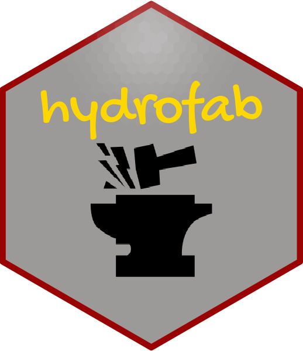

<!-- README.md is generated from README.Rmd. Please edit that file -->

```{r, include = FALSE}
knitr::opts_chunk$set(
  collapse = TRUE,
  comment = "#>",
  fig.path = "man/figures/README-",
  out.width = "100%"
)
```

# hydrofab: Fabricating Hydrofabrics 

<!-- badges: start -->
[](#)
<!-- badges: end -->

The goal of `hydrofab` is to provide consistent hydrologic and hydraulic network manipulation tool chains to achieve model application ready datasets from a consistent reference fabric. Some of these are being built at [ngen.hydrofab](https://github.com/mikejohnson51/ngen.hydrofab) and [gfv2.0](https://code.usgs.gov/wma/nhgf/gfv2.0)


## Installation

You can install the development version of hydrofab like so:

```
install.packages("remotes")
remotes::install_github("mikejohnson51/hydrofab")
```

Soon to be ...

```
install.packages("remotes")
remotes::install_github("NOAA-OWP/hydrofab")
```

## Introduction 

This package is based around the same concepts as [nhdplusTools](https://usgs-r.github.io/nhdplusTools/) and uses its utilities extensively. It is the creation of merging the 
previous `hyRefactor` and `hyAggregate` packages in an attempt to provide a common software stack of fabricating hydrofabrics.

### Refactoring and Aggregating

The concept of refactoring as intended here includes:

1) **Splitting** large or long catchments to create a more uniform catchment size
distribution,  
2) **collapsing** catchment topology to eliminate small catchments


The concept of aggregating as intended here includes **aggregating** catchments into groups based on existing network topology and defined criteria. Two primary use cases are offered:

1. Aggregating to a set of defined outlet locations
2. Aggregating to a uniform catchment size with enforced minimum areas and lengths.

This type of functionality is especially relevant to modeling applications that
need specific modeling unit characteristics but wish to preserve the network as
much as possible for interoperability with other applications 


### Check notes:

In addition to typical R package, a Dockerfile is included in this repository. Once built, it can be run with the following command.

```
docker build -t hydrofab_test .

# Linux/Mac

docker run --rm -it -v $PWD:/src hydrofab_test /bin/bash -c "cp -r /src/* /check/ && cp /src/.Rbuildignore /check/ && cd /check && Rscript -e 'devtools::build(vignettes = FALSE)' && R CMD check --as-cran ../hydrofab_*"

# Windows
docker run --rm -it -v %cd%:/src hydrofab_test /bin/bash -c "cp -r /src/* /check/ && cp /src/.Rbuildignore /check/ && cd /check && Rscript -e 'devtools::build(vignettes = FALSE)' && R CMD check --as-cran ../hydrofab_"
```

## Disclaimer

This information is preliminary or provisional and is subject to revision. It is being provided to meet the need for timely best science. The information has not received final approval by the U.S. Geological Survey (USGS) and is provided on the condition that neither the USGS nor the U.S. Government shall be held liable for any damages resulting from the authorized or unauthorized use of the information.

From: https://www2.usgs.gov/fsp/fsp_disclaimers.asp#5

This software is in the public domain because it contains materials that originally came from the U.S. Geological Survey, an agency of the United States Department of Interior. For more information, see the [official USGS copyright policy](https://www.usgs.gov/information-policies-and-instructions/copyrights-and-credits "official USGS copyright policy")

Although this software program has been used by the USGS, no warranty, expressed or implied, is made by the USGS or the U.S. Government as to the accuracy and functioning of the program and related program material nor shall the fact of distribution constitute any such warranty, and no responsibility is assumed by the USGS in connection therewith.
This software is provided "AS IS."


