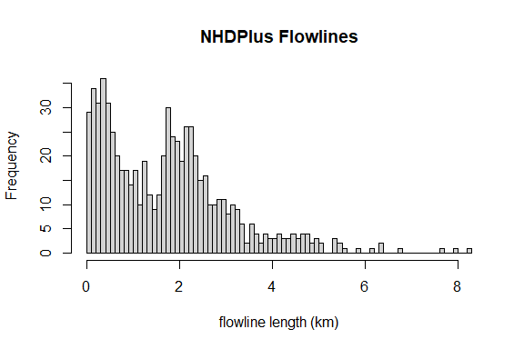
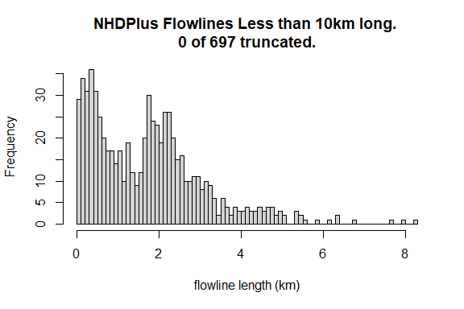
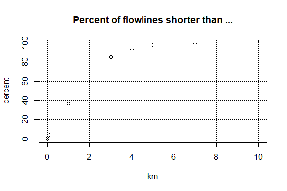
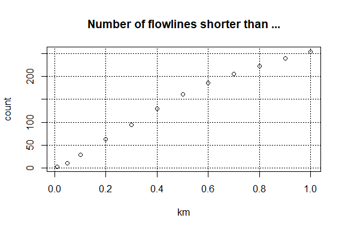
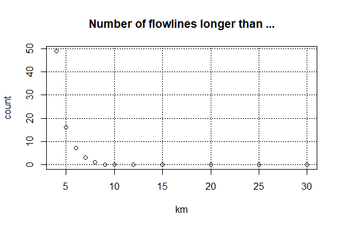
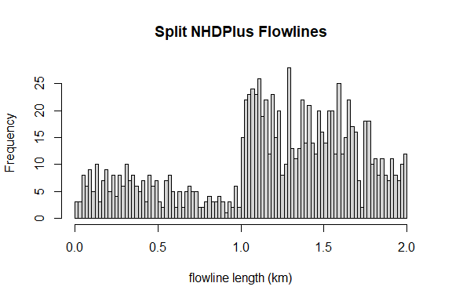
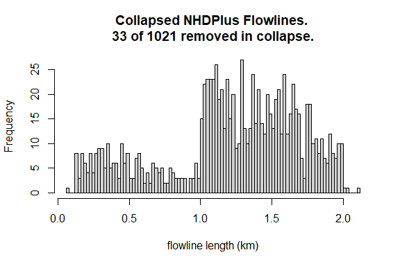
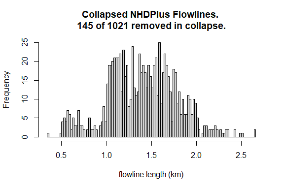
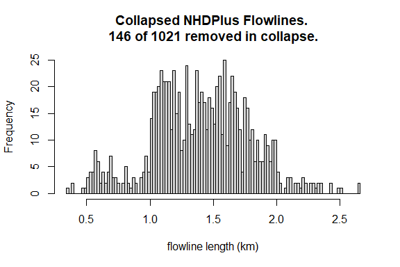
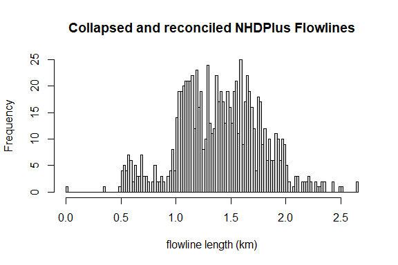

## NHDPlus Network Refactor

This vignette summarizes the workflow implemented by the
`refactor_nhdplus()` function to normalize flowline length in the
NHDPlus network by splitting long flow lines and collapsing short
flowlines. After running this, you may want to read
`vignette("refactor_catchment")` to see how to apply the refactored
network to catchment polygons.

The code developed for this is parameterizable and this vignette is
presented with target lengths of 2km for long flowlines splits and 0.5km
for minimum flowlines length. While this workflow can be run on the
entire network, for this example, we will use the sample network subset
included in the `nhdplusTools` package.

The first section describes the network as it exists without
modification. Following that, each processing step is illustrated and
final results are summarized.

## Network Preparation

Prior to summarizing the network, some NHDPlus conditioning can be
performed. The following function removes coastal and non-dendritic
flowlines. It can also remove networks with an outlet drainage area
under a threshold or a longest path length under a threshold, but those
inputs are set to 0 such that all networks are included here. Note that
this is especially important when running the whole country – little
change is applied to network subsets that follow the network upstream
with tributaries.

    source(system.file("extdata",
                       "sample_flines.R",
                       package = "nhdplusTools"))

    nhdplus_flines <- sample_flines
    min_network_size <- 0
    min_path_length <- 0
    flines <- prepare_nhdplus(st_set_geometry(nhdplus_flines, NULL), 
                              min_network_size, 
                              min_path_length)
    #> Warning in prepare_nhdplus(st_set_geometry(nhdplus_flines, NULL), min_network_size, : Removed 10 flowlines that don't apply.
    #>  Includes: Coastlines, non-dendritic paths, 
    #> and networks with drainage area less than 0 sqkm, and drainage basins smaller than 0

The following histograms and plots show characteristics of the NHDPlusV2
network flowline lengths.

## refactor\_nhdplus function

The complete refactor workflow has been packaged into a single function
that can be called as shown below. For the purposes of demonstration
this function is not used and individual package functions called by it
are shown.

    ## Not Run ##
    refactor_nhdplus(nhdplus_flines = nhdplus_flines,
                     split_flines_meters = 2000, 
                     split_flines_cores = 2,
                     collapse_flines_meters = 500, 
                     collapse_flines_main_meters = 500,
                     out_refactored = "nhdplus_collapsed.gpkg",
                     out_reconciled = "nhdplus_reconciled.gpkg",
                     three_pass = TRUE)

The inputs to this are:

-   nhdplus\_flines: raw nhdplus flowline features as derived from the
    national seamless geodatabase.
-   split\_flines\_meters: the maximum length flowline desired in the
    output.
-   split\_flines\_cores: the number of processing cores to use while
    splitting flowlines.
-   collapse flines\_meters: the minimum length of inter-confluence
    flowline desired in the output.
-   collapse\_flines\_main\_meters: the minimum length of
    between-confluence flowlines.
-   out\_refactored: where to write a geopackage containing the split
    and collapsed flowlines.
-   out\_reconciled: where to write a geoppackage containing the
    reconciled flowlines.
-   three\_pass: whether to perform a three pass collapse or single
    pass. These inputs are described in detail below.

## Split flowlines

The split\_flowlines feature requires flowlines with geometry but for
performance reasons, the prep\_nhdplus function works with attributes
only. The code below, joins the geometry back, coerces it to the
required geometry type, and projects it to a projection suited to
distance measurement at the contental scale of NHDPlus. It then executes
the split\_flowlines function.

    flines <- inner_join(select(nhdplus_flines, COMID), flines, by = "COMID") %>%
        st_as_sf() %>%
        st_cast("LINESTRING") %>%
        st_transform(5070)
    #> Warning in st_cast.sf(., "LINESTRING"): repeating attributes for
    #> all sub-geometries for which they may not be constant

    flines <- split_flowlines(flines, 
                              max_length = 2000, 
                              para = 3)

As can be seen here, `split_flowlines` breaks long flowlines into equal
length pieces, which results in the new distribution of flowline lengths
shown.

## Collapse Flowlines

Now we can collapse very short flowlines.

    collapse_flines_meters <- 500
    collapse_flines_main_meters <- 500
    collapsed_flines <- collapse_flowlines(st_set_geometry(flines, NULL),
                                               (0.25*collapse_flines_meters/1000),
                                               TRUE,
                                               (0.25*collapse_flines_main_meters/1000))

As can be seen here, some collapsed flowlines extend the split
flowlines. This is a result of chains of very short flowlines being
collapsed together. This problem is more or less unavoidable but is
improved by running the collapse step a few times with small to large
input thresholds as is done next.

## Collapse step two and three

Now we can collapse twice more

    collapsed_flines <- collapse_flowlines(collapsed_flines,
                                           (0.5*collapse_flines_meters/1000),
                                           TRUE,
                                           (0.5*collapse_flines_main_meters/1000),
                                           warn = FALSE)

    collapsed_flines <- collapse_flowlines(collapsed_flines,
                                           (collapse_flines_meters/1000),
                                           TRUE,
                                           (collapse_flines_main_meters/1000),
                                           warn = FALSE)

    # Now we can save the output
     select(flines, COMID) %>%
        inner_join(collapsed_flines, by = "COMID") %>%
        st_as_sf() %>%
        st_transform(4326) %>%
        st_write("nhdplus_collapsed.gpkg", layer_options = "OVERWRITE=YES", quiet = TRUE)

As shown here, the distribution of flowline lengths is much tighter now
but very small headwaters and long chains of collapsed flowlines remain
out of the desired range. For the sake of completness,

    collapsed_flines_one_pass <- collapse_flowlines(st_set_geometry(flines, NULL),
                                                    (collapse_flines_meters/1000),
                                                    TRUE,
                                                    (collapse_flines_main_meters/1000))

As shown in this historigram, the problem of long chains of collapsed
flowlines is much worse when the collapse is run only once.

## Reconcile collapsed flowlines

Now that we have our flowlines collapsed, we need to reconcile the
results into merged geometries with updated ids. The
reconcile\_collapsed\_flowlines function does this including a column
that contains a comma seperated list of catchment ids that were merged
together to form each new flowline.

    collapsed <- reconcile_collapsed_flowlines(collapsed_flines, 
                                               geom = select(flines, COMID), 
                                               id = "COMID")

    collapsed$member_COMID <- sapply(collapsed$member_COMID, paste, collapse = ",")

    st_write(st_transform(collapsed, 4326), "nhdplus_reconciled.gpkg", layer_options = "OVERWRITE=YES")
    #> Writing layer `nhdplus_reconciled' to data source 
    #>   `nhdplus_reconciled.gpkg' using driver `GPKG'
    #> options:        OVERWRITE=YES 
    #> Writing 877 features with 8 fields and geometry type Unknown (any).

## Examples

  
This image (and those below) show the original NHDPlus network in blue
with streams greater than first order rendered with a thick blue line.
Blue dots are where the original NHDPlus flowline breaks were and red
dots are where the new refactored flowline breaks are. Notice that lone
red dots are the result of splitting flowlines and lone blue dots are
the result of collapsing them.

  
This image shows an example of a chain combination. All the small
tributaries that intersect the highlighted mainstem are routed to the
outlet of the mainstem flowline and have a length attribute that is the
distance to that outlet. This problem is especially common where there
is a high density of small tributaries meeting a mainstem like in the
case shown here. The longest tributary here routed to the oulet of the
mainstem is the longest single flowline in the result set (5.5km) shown
in the histogram above.

  
This image shows how short headwater flowlines can be collapsed
downstream. The two open blue dots are where three short flowlines were
collapsed into one 2km long flowline.

  
This image shows a coastal system with very long flowlines that have
largely been split into many pieces.

  
This image is a zoomed in view of the outlet and coastal drainages of
the system in the image above. Not that there are numerous
single-flowling coastal systems in the NHDPlus.
